# 4. ERD

## 4.1 Mermaid 다이어그램

```mermaid
erDiagram
    %% Member Context
    MEMBER ||--o{ PET : owns
    MEMBER ||--o{ THREAD : creates
    MEMBER ||--o{ CHAT_PARTICIPANT : participates
    MEMBER ||--o{ MESSAGE : sends
    MEMBER ||--o{ LOST_PET_REPORT : reports
    MEMBER ||--o{ SIGHTING : finds
    MEMBER ||--o{ POST : writes
    MEMBER ||--o{ COMMENT : writes
    MEMBER ||--o{ POST_LIKE : likes
    MEMBER ||--o{ BLOCK : blocks
    MEMBER ||--o{ MANNER_SCORE : gives
    MEMBER ||--o{ MANNER_SCORE : receives
    MEMBER ||--o{ REFRESH_TOKEN : has
    MEMBER ||--o{ MEMBER_PERSONALITY : has
    MEMBER ||--o{ NOTIFICATION : receives
    MEMBER ||--|| NOTIFICATION_SETTING : has
    
    %% Pet Context
    PET ||--o{ PET_PERSONALITY : has
    PET ||--o{ PET_WALKING_STYLE : has
    PET ||--o{ THREAD_PET : joins
    BREED ||--o{ PET : categorizes
    PET_PERSONALITY_TYPE ||--o{ PET_PERSONALITY : defines
    WALKING_STYLE ||--o{ PET_WALKING_STYLE : defines
    
    %% Member Personality
    MEMBER_PERSONALITY_TYPE ||--o{ MEMBER_PERSONALITY : defines
    
    %% Walk Context
    THREAD ||--o{ THREAD_PET : includes
    THREAD ||--o{ THREAD_FILTER : has
    THREAD ||--o{ CHAT_ROOM : "creates (WALK)"
    
    %% Chat Context
    CHAT_ROOM ||--o{ CHAT_PARTICIPANT : contains
    CHAT_ROOM ||--o{ MESSAGE : contains
    CHAT_ROOM ||--o{ MANNER_SCORE : has
    
    %% Lost Pet Context
    LOST_PET_REPORT ||--o{ LOST_PET_MATCH : matches
    SIGHTING ||--o{ LOST_PET_MATCH : matches
    LOST_PET_MATCH ||--o| CHAT_ROOM : "creates (LOST_PET_MATCH)"
    
    %% Community Context
    POST ||--o{ COMMENT : has
    POST ||--o{ POST_LIKE : has

    %% Entity Definitions
    MEMBER {
        bigint id PK
        varchar email UK
        varchar nickname UK
        varchar profile_image_url
        int age
        varchar gender
        varchar mbti
        varchar personality
        text self_introduction
        varchar member_type
        varchar linked_nickname
        decimal manner_temperature
        int manner_score_sum
        int manner_score_count
        varchar status
        tinyint is_verified
        varchar social_provider
        varchar social_id
        datetime created_at
        datetime updated_at
    }

    REFRESH_TOKEN {
        bigint id PK
        bigint member_id "INDEX"
        varchar token_hash
        datetime expires_at
        datetime revoked_at
        datetime created_at
    }
    
    MEMBER_PERSONALITY_TYPE {
        bigint id PK
        varchar name UK
        varchar code UK
        datetime created_at
    }
    
    MEMBER_PERSONALITY {
        bigint id PK
        bigint member_id "INDEX"
        bigint personality_type_id "INDEX"
        datetime created_at
    }
    
    PET {
        bigint id PK
        bigint member_id "INDEX"
        bigint breed_id "INDEX"
        varchar name
        int age
        varchar gender
        varchar size
        varchar mbti
        tinyint is_neutered
        varchar photo_url
        tinyint is_main
        varchar certification_number
        tinyint is_certified
        datetime created_at
        datetime updated_at
    }
    
    BREED {
        bigint id PK
        varchar name UK
        varchar size
        datetime created_at
    }
    
    PET_PERSONALITY_TYPE {
        bigint id PK
        varchar name UK
        varchar code UK
        datetime created_at
    }
    
    PET_PERSONALITY {
        bigint id PK
        bigint pet_id "INDEX"
        bigint personality_type_id "INDEX"
        datetime created_at
    }

    WALKING_STYLE {
        bigint id PK
        varchar name UK
        varchar code UK
        datetime created_at
    }
    
    PET_WALKING_STYLE {
        bigint id PK
        bigint pet_id "INDEX"
        bigint walking_style_id "INDEX"
        datetime created_at
    }
    
    THREAD {
        bigint id PK
        bigint author_id "INDEX"
        varchar title
        text description
        date walk_date
        datetime start_time
        datetime end_time
        varchar chat_type
        int max_participants
        int current_participants
        tinyint is_allow_non_pet_owner
        tinyint is_visible_always
        varchar status
        varchar place_name
        decimal latitude
        decimal longitude
        varchar address
        datetime created_at
        datetime updated_at
    }
    
    THREAD_PET {
        bigint id PK
        bigint thread_id "INDEX"
        bigint pet_id "INDEX"
        datetime created_at
    }
    
    THREAD_FILTER {
        bigint id PK
        bigint thread_id "INDEX"
        varchar filter_type
        text filter_values
        tinyint is_required
        datetime created_at
    }
    
    CHAT_ROOM {
        bigint id PK
        varchar room_purpose "INDEX"
        bigint thread_id "INDEX (nullable)"
        bigint lost_pet_match_id "INDEX (nullable)"
        varchar chat_type
        varchar status
        datetime archived_at
        datetime created_at
        datetime updated_at
    }
    
    CHAT_PARTICIPANT {
        bigint id PK
        bigint chat_room_id "INDEX"
        bigint member_id "INDEX"
        tinyint is_author
        datetime joined_at
        datetime left_at
        datetime walk_confirmed_at
    }
    
    CHAT_PARTICIPANT_PET {
        bigint id PK
        bigint chat_participant_id "INDEX"
        bigint pet_id "INDEX"
        datetime created_at
    }
    
    MESSAGE {
        bigint id PK
        bigint chat_room_id "INDEX"
        bigint sender_id "INDEX"
        varchar message_type
        text content
        datetime sent_at
    }
    
    LOST_PET_REPORT {
        bigint id PK
        bigint member_id "INDEX"
        bigint pet_id "INDEX"
        text description
        text photo_urls
        varchar cropped_photo_url
        vector image_embedding
        vector text_embedding
        text text_features
        varchar place_name
        decimal last_seen_latitude
        decimal last_seen_longitude
        varchar address
        datetime last_seen_at
        varchar status
        tinyint is_notification_enabled
        datetime created_at
        datetime updated_at
        datetime closed_at
    }
    
    SIGHTING {
        bigint id PK
        bigint finder_id "INDEX"
        varchar photo_url
        varchar cropped_photo_url
        vector image_embedding
        text description
        varchar place_name
        decimal found_latitude
        decimal found_longitude
        varchar address
        datetime found_at
        varchar status
        datetime created_at
        datetime updated_at
    }
    
    LOST_PET_MATCH {
        bigint id PK
        bigint lost_pet_report_id "INDEX"
        bigint sighting_id "INDEX"
        bigint chat_room_id "INDEX"
        decimal similarity_score
        varchar status
        datetime created_at
        datetime updated_at
    }
    
    POST {
        bigint id PK
        bigint author_id "INDEX"
        text content
        text image_urls
        int like_count
        int comment_count
        datetime created_at
        datetime updated_at
    }
    
    COMMENT {
        bigint id PK
        bigint post_id "INDEX"
        bigint author_id "INDEX"
        text content
        datetime created_at
    }
    
    POST_LIKE {
        bigint id PK
        bigint post_id "INDEX"
        bigint member_id "INDEX"
        datetime created_at
    }
    
    MANNER_SCORE {
        bigint id PK
        bigint chat_room_id "INDEX"
        bigint reviewer_id "INDEX"
        bigint reviewee_id "INDEX"
        tinyint score
        text comment
        datetime created_at
    }
    
    BLOCK {
        bigint id PK
        bigint blocker_id "INDEX"
        bigint blocked_id "INDEX"
        datetime created_at
    }
    
    NOTIFICATION {
        bigint id PK
        bigint member_id "INDEX"
        varchar notification_type
        varchar title
        text content
        varchar target_type
        bigint target_id
        tinyint is_read
        datetime created_at
    }
    
    NOTIFICATION_SETTING {
        bigint id PK
        bigint member_id UK
        tinyint is_chat_message_enabled
        tinyint is_walk_application_enabled
        tinyint is_lost_pet_similar_enabled
        datetime created_at
        datetime updated_at
    }
```

## 4.2 테이블 상세 설명

### MEMBER (회원)

예약어 회피: user → member

| 컬럼 | 타입 | 설명 |
|------|------|------|
| id | BIGINT | PK, 자동증가 |
| email | VARCHAR(255) | 이메일 (고유) |
| nickname | VARCHAR(50) | 닉네임 (최대 10자) |
| profile_image_url | VARCHAR(500) | 프로필 이미지 URL |
| age | INT | 나이 |
| gender | VARCHAR(10) | 성별: MALE, FEMALE, UNKNOWN |
| mbti | VARCHAR(10) | MBTI |
| personality | VARCHAR(200) | 성격 |
| self_introduction | TEXT | 자기소개 |
| member_type | VARCHAR(20) | 유형: PET_OWNER, NON_PET_OWNER (기본 NON_PET_OWNER, 반려견 등록 시 PET_OWNER 자동 전환) |
| linked_nickname | VARCHAR(50) | 애견 연계 닉네임 |
| manner_temperature | DECIMAL(3,1) | 매너 온도 (평균, 1.0~10.0) |
| manner_score_sum | INT | 받은 매너 점수 합 (정수) |
| manner_score_count | INT | 받은 매너 점수 개수 |
| status | VARCHAR(20) | 상태: ACTIVE, INACTIVE, BANNED |
| is_verified | TINYINT(1) | 인증 완료 여부 |
| social_provider | VARCHAR(20) | 소셜: NAVER, KAKAO, GOOGLE |
| social_id | VARCHAR(255) | 소셜 고유 ID |
| created_at | DATETIME | 생성일시 |
| updated_at | DATETIME | 수정일시 |

**인덱스**
- `uk_email`: email (UNIQUE)
- `uk_social`: social_provider, social_id (UNIQUE)
- `uk_nickname`: nickname (UNIQUE)
- `idx_status`: status

---

### REFRESH_TOKEN (리프레시 토큰)

| 컬럼 | 타입 | 설명 |
|------|------|------|
| id | BIGINT | PK |
| member_id | BIGINT | 회원 ID (INDEX) |
| token_hash | VARCHAR(255) | 리프레시 토큰 해시 |
| expires_at | DATETIME | 만료 시각 |
| revoked_at | DATETIME | 폐기 시각 (nullable) |
| created_at | DATETIME | 생성일시 |

**인덱스**
- `idx_member_id`: member_id
- `idx_expires_at`: expires_at

---

### MEMBER_PERSONALITY_TYPE (견주 성향 카테고리)

| 컬럼 | 타입 | 설명 |
|------|------|------|
| id | BIGINT | PK |
| name | VARCHAR(50) | 성향명 (UNIQUE) |
| code | VARCHAR(30) | 성향 코드 (UNIQUE) |
| created_at | DATETIME | 생성일시 |

---

### MEMBER_PERSONALITY (회원-견주 성향 연결)

| 컬럼 | 타입 | 설명 |
|------|------|------|
| id | BIGINT | PK |
| member_id | BIGINT | 회원 ID (INDEX) |
| personality_type_id | BIGINT | 견주 성향 ID (INDEX) |
| created_at | DATETIME | 생성일시 |

**제약**
- (member_id, personality_type_id) UNIQUE (중복 선택 방지)

---

### PET (반려견)

| 컬럼 | 타입 | 설명 |
|------|------|------|
| id | BIGINT | PK |
| member_id | BIGINT | 소유자 ID (INDEX) |
| breed_id | BIGINT | 견종 ID (INDEX) |
| name | VARCHAR(50) | 이름 (최대 10자) |
| age | INT | 나이 |
| gender | VARCHAR(10) | 성별: MALE, FEMALE |
| size | VARCHAR(10) | 크기: SMALL, MEDIUM, LARGE |
| mbti | VARCHAR(10) | MBTI |
| is_neutered | TINYINT(1) | 중성화 여부 |
| photo_url | VARCHAR(500) | 사진 URL |
| is_main | TINYINT(1) | 메인 반려견 여부 |
| certification_number | VARCHAR(20) | 동물등록번호 |
| is_certified | TINYINT(1) | 인증 여부 |
| created_at | DATETIME | 생성일시 |
| updated_at | DATETIME | 수정일시 |

**인덱스**
- `idx_member_id`: member_id
- `idx_breed_id`: breed_id
- `idx_member_main`: member_id, is_main

---

### THREAD (산책 모집 스레드)

| 컬럼 | 타입 | 설명 |
|------|------|------|
| id | BIGINT | PK |
| author_id | BIGINT | 작성자 ID (INDEX) |
| title | VARCHAR(100) | 제목 (최대 30자) |
| description | TEXT | 소개글 (최대 500자) |
| walk_date | DATE | 산책 날짜 |
| start_time | DATETIME | 시작 시간 (KST) |
| end_time | DATETIME | 종료 시간 (KST) |
| chat_type | VARCHAR(20) | 채팅 방식: INDIVIDUAL, GROUP |
| max_participants | INT | 최대 참가자 (그룹: 3~10) |
| current_participants | INT | 현재 참가자/신청 수 (GROUP: 참가자 수, INDIVIDUAL: 활성 1:1 채팅방 수) |
| is_allow_non_pet_owner | TINYINT(1) | 비애견인 허용 여부 |
| is_visible_always | TINYINT(1) | 항상 지도 표시 |
| status | VARCHAR(20) | 상태: ACTIVE, CLOSED |
| place_name | VARCHAR(200) | 장소명 |
| latitude | DECIMAL(10,8) | 위도 |
| longitude | DECIMAL(11,8) | 경도 |
| address | VARCHAR(500) | 주소 |
| created_at | DATETIME | 생성일시 |
| updated_at | DATETIME | 수정일시 |

**인덱스**
- `idx_author_id`: author_id
- `idx_status`: status
- `idx_status_date`: status, walk_date
- `idx_location`: latitude, longitude
- `idx_start_time`: start_time
- `idx_author_status`: author_id, status

---

### CHAT_ROOM (채팅방)

| 컬럼 | 타입 | 설명 |
|------|------|------|
| id | BIGINT | PK |
| room_purpose | VARCHAR(20) | 채팅방 용도: WALK, LOST_PET_MATCH |
| thread_id | BIGINT | 스레드 ID (WALK 채팅방, nullable) |
| lost_pet_match_id | BIGINT | 실종-제보 매칭 ID (LOST_PET_MATCH 채팅방, nullable) |
| chat_type | VARCHAR(20) | 채팅 방식: INDIVIDUAL, GROUP |
| status | VARCHAR(20) | 상태: ACTIVE, ARCHIVED |
| archived_at | DATETIME | 아카이브 시간 |

**인덱스**
- `idx_room_purpose`: room_purpose
- `idx_thread_id`: thread_id
- `idx_lost_pet_match_id`: lost_pet_match_id
- `idx_status`: status

---

### MANNER_SCORE (산책 후기/매너 평가)

| 컬럼 | 타입 | 설명 |
|------|------|------|
| id | BIGINT | PK |
| chat_room_id | BIGINT | 채팅방 ID (INDEX, room_purpose=WALK) |
| reviewer_id | BIGINT | 작성자 ID (INDEX) |
| reviewee_id | BIGINT | 대상자 ID (INDEX) |
| score | TINYINT | 점수 (1~10) |
| comment | TEXT | 한줄 후기 (선택) |
| created_at | DATETIME | 생성일시 |

**인덱스/제약**
- `idx_chat_room_id`: chat_room_id
- `idx_reviewer_id`: reviewer_id
- `idx_reviewee_id`: reviewee_id
- `uk_chat_room_reviewer_reviewee`: chat_room_id, reviewer_id, reviewee_id (UNIQUE)

---

### LOST_PET_REPORT (실종 반려견 신고)

| 컬럼 | 타입 | 설명 |
|------|------|------|
| id | BIGINT | PK |
| member_id | BIGINT | 견주 ID (INDEX) |
| pet_id | BIGINT | 반려견 ID (INDEX) |
| description | TEXT | 상세 설명 |
| photo_urls | TEXT | 사진 URL 목록 (JSON) |
| cropped_photo_url | VARCHAR(500) | YOLO 크롭 이미지 URL |
| image_embedding | VECTOR(512) | CLIP 이미지 벡터 |
| text_embedding | VECTOR(512) | CLIP 텍스트 벡터 |
| text_features | TEXT | 텍스트 특징 설명 |
| place_name | VARCHAR(200) | 마지막 목격 장소명 |
| last_seen_latitude | DECIMAL(10,8) | 마지막 목격 위도 |
| last_seen_longitude | DECIMAL(11,8) | 마지막 목격 경도 |
| last_seen_at | DATETIME | 마지막 목격 시간 |
| status | VARCHAR(20) | 상태: SEARCHING, FOUND, CLOSED |
| is_notification_enabled | TINYINT(1) | 알림 수신 여부 |
| closed_at | DATETIME | 종료 시간 |

**인덱스**
- `idx_member_id`: member_id
- `idx_pet_id`: pet_id
- `idx_status`: status
- `idx_location`: last_seen_latitude, last_seen_longitude
- `idx_last_seen_at`: last_seen_at

---

### SIGHTING (발견 제보)

| 컬럼 | 타입 | 설명 |
|------|------|------|
| id | BIGINT | PK |
| finder_id | BIGINT | 제보자 ID (INDEX) |
| photo_url | VARCHAR(500) | 사진 URL |
| cropped_photo_url | VARCHAR(500) | YOLO 크롭 이미지 URL |
| image_embedding | VECTOR(512) | CLIP 이미지 벡터 |
| description | TEXT | 설명 (선택) |
| place_name | VARCHAR(200) | 발견 장소명 |
| found_latitude | DECIMAL(10,8) | 발견 위도 |
| found_longitude | DECIMAL(11,8) | 발견 경도 |
| address | VARCHAR(500) | 주소 |
| found_at | DATETIME | 발견 시간 |
| status | VARCHAR(20) | 상태: ACTIVE, MATCHED |
| created_at | DATETIME | 생성일시 |
| updated_at | DATETIME | 수정일시 |

**인덱스**
- `idx_finder_id`: finder_id
- `idx_status`: status
- `idx_location`: found_latitude, found_longitude
- `idx_found_at`: found_at

---

## 4.3 인덱스 전략 요약

### 참조 컬럼 (FK 미사용)
모든 참조 컬럼에는 INDEX를 생성하고, FK 제약조건은 사용하지 않음.

### 복합 인덱스
| 테이블 | 인덱스 | 용도 |
|--------|--------|------|
| MEMBER | (social_provider, social_id) | 소셜 로그인 조회 |
| PET | (member_id, is_main) | 메인 반려견 조회 |
| THREAD | (status, walk_date) | 활성 스레드 날짜별 조회 |
| THREAD | (latitude, longitude) | 위치 기반 검색 |
| LOST_PET_REPORT | (last_seen_latitude, last_seen_longitude) | 위치 기반 검색 |
| POST_LIKE | (post_id, member_id) | 좋아요 중복 방지 |
| BLOCK | (blocker_id, blocked_id) | 차단 관계 조회 |
| REFRESH_TOKEN | (member_id, expires_at) | 유효 리프레시 토큰 조회/정리 |
| MEMBER_PERSONALITY | (member_id, personality_type_id) | 견주 성향 중복 방지 |

---
